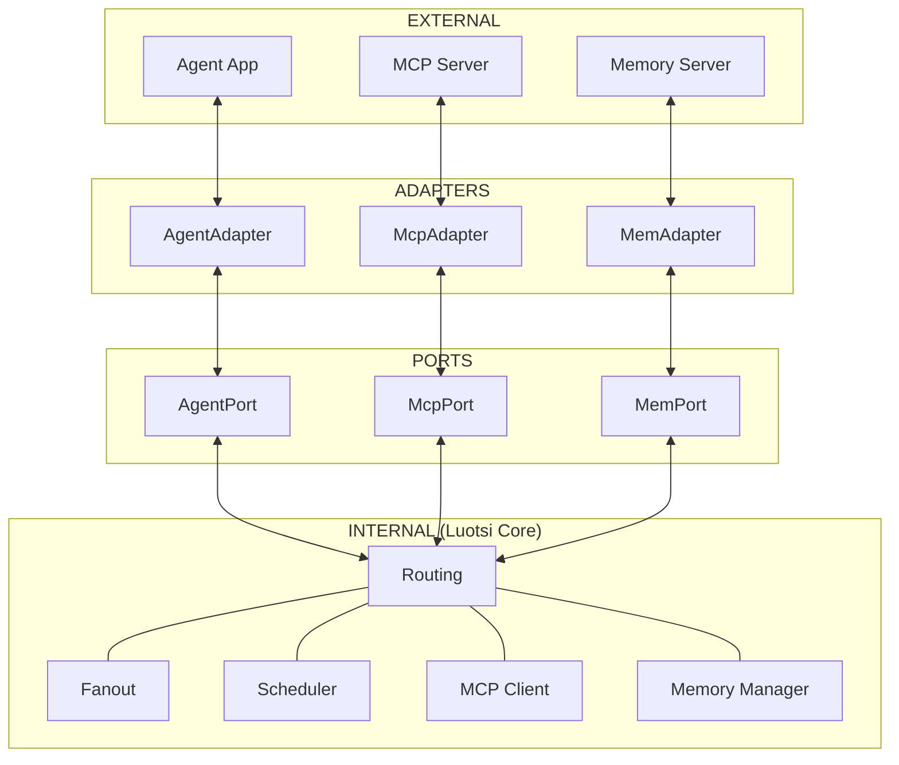

# Architecture Internals (Engine Room)

This document describes the layered architecture of Luotsi, following the **Ports and Adapters** (Hexagonal) pattern.

## The Big Picture

Luotsi is a single-threaded (mostly) asynchronous event loop built on top of `asio`. It acts as a secure, software-defined switch fabric connecting agents to tools and memory.

## Architectural Layers

### 1. INTERNAL (Luotsi Core)
The engine's heart, located in the `luotsi::internal` namespace. It is responsible for high-level orchestration.
- **Routing**: Decisions on where messages should fly based on configuration and dynamic state.
- **Fanout**: Parallelizing requests across multiple providers and aggregating results.
- **Scheduler**: Managing time-based events or deferred actions.
- **MCP Client**: Internal logic to speak the Model Context Protocol to downstream servers.
- **Memory Manager**: Handling session state, short-term memory, and historical context.

### 2. PORTS
Located in the `luotsi::ports` namespace. Abstract definitions of communicative intent.
- **AgentPort**: Interface for agents to connect, authenticate, and issue commands.
- **McpPort**: Interface for tool and resource providers.
- **MemoryPort**: Interface for state and context storage.

The `PortImpl` template (`src/ports/port_impl.hpp`) provides a generic bridge between the internal bus and specialized adapters.

### 3. BOUNDARY PROTOCOL
The standardized languages used at the threshold of the Core.
- **ACP (Agent Core Protocol)**: The specialized JSON-RPC dialect used between Agents and the Luotsi Core.
- **A2A**: Protocol for direct or mediated communication between different agents within the hub.

### 4. ADAPTERS
Located in the `luotsi::adapters` namespace. Concrete implementations of the `IAdapter` interface.
- **AgentAdapter**: Usually `stdio` (local process/Docker) or `JsonRpcTcpAdapter`.
- **McpAdapter**: Implements transport for MCP servers (often `stdio` or `SSE`).
- **MemoryAdapter**: Connects to storage backends (SQLite, Redis, etc.).

### 5. EXTERNAL
The autonomous entities that exist outside of Luotsi's direct control.
- **Agent**: The LLM-driven intelligence (e.g., LangChain, AutoGPT).
- **MCP server**: A provider of tools and resources (e.g., Odoo, Postgres, Google Maps).
- **Memory server**: A specialized node providing context retrieval (vector DBs, graph DBs).

## Core Implementation Details

### `luotsi::internal::Runtime` (`src/core/runtime.hpp`)
The main application class that owns the `asio::io_context` and orchestrates the lifecycle of all adapters. It mediates between the internal registry and the physical adapters via Port interfaces.

### `luotsi::IAdapter` (`src/adapters/adapter.hpp`)
The base interface for all adapters. It provides the standard hooks for `send`, `on_receive`, and lifecycle management.

### Routing Logic
Routing is driven by the `routes` list in YAML. Key actions include:
- `mcp_registry_query`: Serves capabilities from internal cache.
- `mcp_call_router`: Inspects and routes tool calls by namespaced prefix.
- `fan_out_mcp`: Broadcasts a request to multiple targets.

## Coordinated Startup (Dependency Orchestration)
The Core manages dependencies using the `depends` configuration. It defers spawning nodes until their required ports/adapters (and their discovery handshakes) are fully ready.

## Architectural Philosophy: Switch Fabric vs Edge Gateway

A common question is how Luotsi differs from an MCP Proxy like **AgentGateway**. They represent two distinct architectural patterns:

### The Pull/Proxy Pattern (AgentGateway)
An API Gateway pattern optimized for routing external network traffic.
- **Outside-In Networking:** Acts as an edge server binding to TCP ports (e.g., HTTP/SSE) and waits for external connections.
- **HTTP Awareness:** The core proxy contains built-in routing logic for HTTP, SSE, and WebSockets.
- **Best Use Case:** Serving as the public "front door" for multiple external clients accessing an internal fleet of servers.

### The Push/Orchestrator Pattern (Luotsi)
An Operating System / Switch Fabric pattern optimized for security and strict internal orchestration.
- **Inside-Out Networking:** Luotsi actively *spawns* components as child processes and governs their `stdio` pipelines. It does not wait for clients to connect.
- **Protocol Agnostic:** The core `C++` binaries do not understand HTTP. They route pure JSON-RPC. To expose Luotsi to the web, you configure an "Edge Node" child process (such as the WhatsApp Gateway or an Inspector Gateway) whose sole job is translating between HTTP and Luotsi's `stdio` bus.
- **Best Use Case:** Securing, observing, and enforcing granular RBAC policies between heterogeneous local components (LLM Agents, Tools, Memory) without exposing unnecessary attack surfaces to the network layer.
