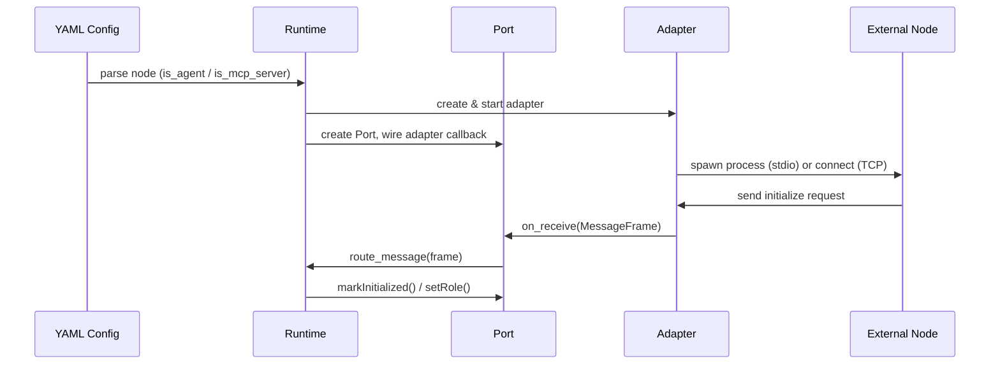

# Ports Layer

This document covers the **Ports** layer of the Luotsi Core, which sits between the [Adapters](../adapters/stdio.md) (raw transport) and the [Internal Core](./architecture.md) (routing, policies, observability).

Luotsi follows the **Ports and Adapters (Hexagonal Architecture)** pattern. Ports are the abstract boundary: they define *what* the Core can communicate with, independently of *how* that communication works.

---

## Conceptual Role

```
[External Process]
        │
        ▼
  [Adapter]            ← handles raw bytes (stdio, TCP, etc.)
        │
        ▼
   [Port]              ← typed boundary: AgentPort or McpPort
        │
        ▼
[Internal Core]        ← routing, policies, observability
```

A **Port** is created once per connected node. The Core uses the Port's interface to send and receive `MessageFrame` objects without knowing the underlying transport mechanism.

---

## Base Interface: `IPort`

**File:** [`src/ports/port.hpp`](file:///home/andy/code/luotsi/luotsi-core/src/ports/port.hpp)

```cpp
class IPort {
public:
    virtual void send(const luotsi::MessageFrame& frame) = 0;
    virtual void set_on_receive(OnReceiveCallback callback) = 0;
    virtual std::string get_id() const = 0;
};
```

All ports implement this interface. The Core uses only `IPort` references, making the routing layer completely agnostic of whether the other end is a Docker container or a TCP connection.

| Method            | Direction        | Description                                       |
|-------------------|------------------|---------------------------------------------------|
| `send()`          | Core → External  | Delivers a `MessageFrame` out through the Adapter |
| `set_on_receive()`| External → Core  | Registers a callback that fires on incoming data  |
| `get_id()`        | -                | Returns the node ID (e.g. `"langchain_agent"`)    |

---

## Specialized Ports

### `AgentPort`

**File:** [`src/ports/agent_port.hpp`](file:///home/andy/code/luotsi/luotsi-core/src/ports/agent_port.hpp)

Used for nodes configured with `is_agent: true` in the YAML config. Extends `IPort` with authentication and role state, which is required for RBAC policy enforcement.

```cpp
class AgentPort : public virtual IPort {
    virtual bool isAuthenticated() const = 0;
    virtual std::string getRole() const = 0;
    virtual void setRole(const std::string& role) = 0;
};
```

| Method              | Description                                                               |
|---------------------|---------------------------------------------------------------------------|
| `isAuthenticated()` | Returns `true` after a valid `luotsi/authenticate` call has been received |
| `getRole()`         | Returns the agent's assigned role (e.g. `"admin"`, `"cs_worker"`)         |
| `setRole()`         | Called by the Auth handler to bind a role; marks the port as authenticated|

> **Policy Enforcement:** Before the Core routes any message from this port, it calls `isAuthenticated()`. If false, the message is rejected.

---

### `McpPort`

**File:** [`src/ports/mcp_port.hpp`](file:///home/andy/code/luotsi/luotsi-core/src/ports/mcp_port.hpp)

Used for nodes configured with `is_mcp_server: true`. Extends `IPort` with capability discovery state, which is populated during the MCP initialization handshake.

```cpp
class McpPort : public virtual IPort {
    virtual bool isInitialized() const = 0;
    virtual void markInitialized(bool ready) = 0;
    virtual void updateCapabilities(const std::string& type, const nlohmann::json& caps) = 0;
    virtual nlohmann::json getCapabilities(const std::string& type) const = 0;
};
```

| Method                 | Description                                                              |
|------------------------|--------------------------------------------------------------------------|
| `isInitialized()`      | Returns `true` once the MCP `initialize` + `notifications/initialized` handshake completes |
| `markInitialized()`    | Called by the Runtime after the MCP handshake succeeds or fails          |
| `updateCapabilities()` | Caches the result of `tools/list`, `resources/list`, `prompts/list`      |
| `getCapabilities()`    | Retrieves the cached capability list for a given type                    |

Capability types are: `"tools"`, `"resources"`, `"templates"`, `"prompts"`.

> **Auto-Discovery:** When a new MCP node starts, the Core automatically calls all four list endpoints and stores the results via `updateCapabilities()`. This is what allows agents to call `mcp_registry_query` and get a live tool catalogue.

---

## Concrete Implementations: `port_impl.hpp`

**File:** [`src/ports/port_impl.hpp`](file:///home/andy/code/luotsi/luotsi-core/src/ports/port_impl.hpp)

Three concrete classes implement the interfaces above using multiple inheritance:

| Class              | Inherits From              | Used For                        |
|--------------------|----------------------------|---------------------------------|
| `GenericPort`      | `IPort`                    | Base, wires the Adapter callback|
| `GenericAgentPort` | `GenericPort`, `AgentPort` | Agent nodes (`is_agent: true`)  |
| `GenericMcpPort`   | `GenericPort`, `McpPort`   | MCP nodes (`is_mcp_server: true`)|

`GenericPort` does the core wiring: in its constructor it calls `adapter_->set_on_receive()` so that raw bytes coming from the Adapter are automatically converted into a `MessageFrame` and forwarded to the Internal Core's routing callback.

```cpp
GenericPort(const std::string& id, std::shared_ptr<IAdapter> adapter)
    : id_(id), adapter_(adapter) {
    adapter_->set_on_receive([this](MessageFrame frame) {
        if (on_receive_) on_receive_(frame);
    });
}
```

---

## Port Lifecycle



---

## Relationship to Config

Each entry in `nodes:` in the YAML config maps to exactly one Port:

```yaml
- id: "langchain_agent"
  is_agent: true         # → GenericAgentPort
  role: "admin"

- id: "odoo_mcp"
  is_mcp_server: true    # → GenericMcpPort
```

If a node has neither `is_agent` nor `is_mcp_server` set, it uses a plain `GenericPort` with no specialized state.

---

## See Also

- [Architecture Overview](./architecture.md)
- [Adapters: STDIO](../adapters/stdio.md)
- [Routing](./routing.md)
- [Policies & RBAC](./policies.md)
