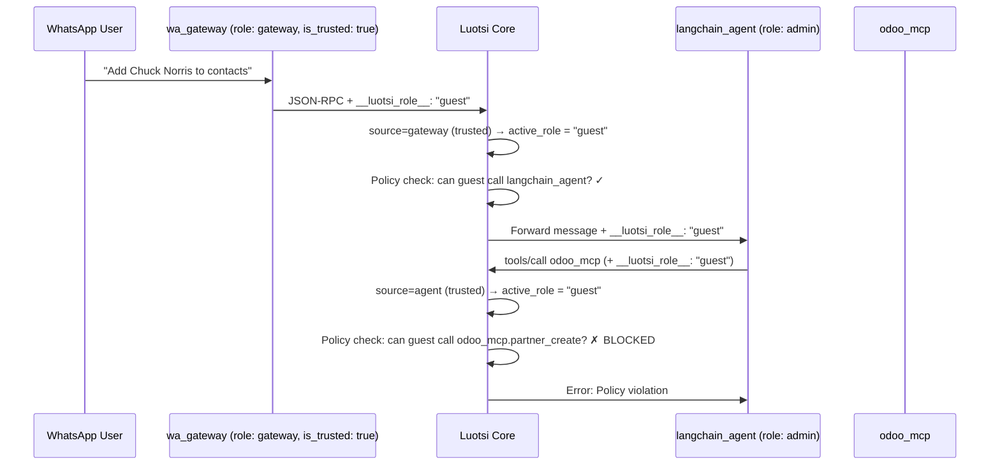

# Multi-Tenancy & Role Delegation

Luotsi supports **multi-tenancy** through a mechanism called **Role Delegation (On-Behalf-Of)**. This allows a single trusted node (e.g., a WhatsApp Gateway) to serve many end-users simultaneously, each with their own permission level, without spawning a separate process per user.

---

## The Problem

In a basic deployment, RBAC roles are bound to the **node's secret key**. A node authenticates once and always acts under its assigned role. This is fine for internal agents, but breaks down when a single gateway node routes messages from many different users with different privilege levels.

---

## The Solution: Role Delegation (`__luotsi_role__`)

A **trusted node** can tag any outbound message with a `__luotsi_role__` field to signal to the Core that this specific message should be treated as if it came from a *different* role.

The Core will then apply that delegated role's policy limits (allowed tools, token size, blocked tools) for the duration of that message's lifecycle — **only if the source node has `is_trusted: true`** in `policies.yaml`.

---

## End-to-End Flow



---

## Implementation

### 1. Injection (Gateway → Core)

The gateway node tags each message with `__luotsi_role__` in the JSON payload before sending it to the Core. In Python:

```python
rpc_msg = {
    "jsonrpc": "2.0",
    "method": "messaging.incoming",
    "params": {...},
    "__luotsi_role__": "guest"   # ← injected by wa_gateway.py
}
```

### 2. Extraction (Adapter Layer)

Both adapters extract `__luotsi_role__` from the raw JSON and store it in `MessageFrame::delegated_role`, then **remove** it from the payload to keep the transport clean.

**[`stdio_adapter.cpp:145-147`](file:///home/andy/code/luotsi/luotsi-core/src/adapters/stdio_adapter.cpp#L145-L147)**:
```cpp
if (json.contains("__luotsi_role__") && json["__luotsi_role__"].is_string()) {
    frame.delegated_role = json["__luotsi_role__"].get<std::string>();
    frame.payload.erase("__luotsi_role__");
}
```

### 3. Trust Check & Role Resolution (Core)

In [`runtime.cpp:1013-1031`](file:///home/andy/code/luotsi/luotsi-core/src/core/runtime.cpp#L1013-L1031), the Core resolves the **effective role** for a message before policy enforcement:

```cpp
bool is_source_trusted = false;
for (const auto& role : roles_) {
    if (role.name == base_role) {
        is_source_trusted = role.is_trusted;
        break;
    }
}

// Only honour the delegation if the source is trusted
if (!frame.delegated_role.empty() && is_source_trusted) {
    return frame.delegated_role;  // e.g. "guest"
}

return base_role;  // fallback to the node's own role
```

If the source node is **not** trusted, the delegated role is silently ignored and the node's own role is used instead.

### 4. Context Preservation (Egress)

When the Core forwards a message to the next node (e.g., the `langchain_agent`), it **re-injects** `__luotsi_role__` so the agent knows the effective role and can pass it along on subsequent tool calls.

**[`stdio_adapter.cpp:114-115`](file:///home/andy/code/luotsi/luotsi-core/src/adapters/stdio_adapter.cpp#L114-L115)**:
```cpp
if (!frame.delegated_role.empty()) {
    out_json["__luotsi_role__"] = frame.delegated_role;
}
```

### 5. Observability

The `delegated_role` is included as a top-level field in every CloudEvent emitted for the message, making it easy to trace user-level activity in the audit log:

```json
{
  "data": {
    "delegated_role": "guest",
    "payload": { ... }
  },
  "luotsisource": "wa_gateway",
  "luotsitarget": "langchain_agent"
}
```

---

## Policy Configuration

Roles are defined in [`policies.yaml`](file:///home/andy/code/luotsi/playground/configs/policies.yaml). The `is_trusted` flag is the **gate** for delegation:

```yaml
roles:
  - name: "gateway"
    is_trusted: true        # ← can delegate roles
    allowed_servers: []     # gateway itself can't call any tools

  - name: "guest"
    allowed_servers: ["odoo_mcp", "cs_agent", "session_memory"]
    allowed_tools:
      - "odoo_mcp:search_*"
      - "cs_agent:reply"
    blocked_tools:
      - "odoo_mcp:execute_kw"
    max_token_size: 20000   # ← per-role token cap
```

> [!IMPORTANT]
> A node cannot grant itself more permissions than its own role allows. If `langchain_agent` (role: `admin`) delegates `guest`, all subsequent tool calls in that message chain are limited to `guest` permissions, even though the agent itself is admin.

---

## Roles Summary

| Role        | Trusted | Can Call Tools                              | Notes                       |
|-------------|---------|---------------------------------------------|-----------------------------|
| `admin`     | ✓       | All servers (`*`)                           | Internal agents             |
| `gateway`   | ✓       | None                                        | Only delegates to other roles|
| `user`      | ✗       | `odoo_mcp`, `cs_agent`, `memory_mcp`       | Can read, cannot write facts|
| `guest`     | ✗       | `odoo_mcp:search_*`, `cs_agent:reply`      | WhatsApp end-users; 20k token cap |
| `cs_worker` | ✗       | `odoo_mcp:search_*`, `memory_mcp:get_fact` | CS Agent sub-tasks          |

---

## Future: RBAC-as-a-Node

For complex enterprise deployments, the Core can be configured to query an external **RBAC Node** to resolve dynamic permissions at runtime, without changing the C++ Kernel. This keeps the Core lean and protocol-agnostic.

---

## See Also

- [Policies & RBAC](./policies.md)
- [Ports Layer](./ports.md)
- [Architecture Overview](./architecture.md)
- [Observability](./governance.md)
